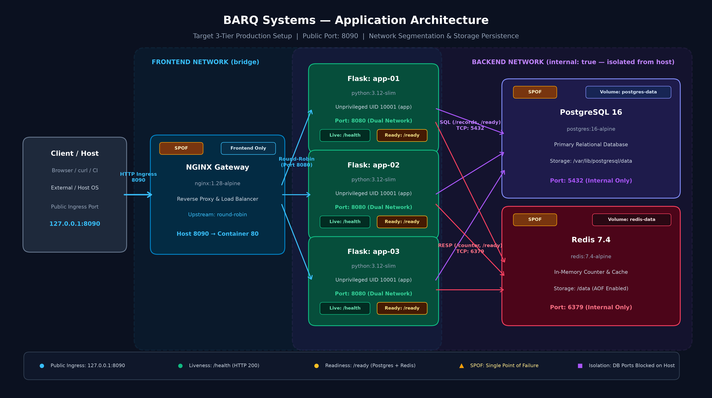

# DevOps Internship Task - Solution & Runbook

A fully remediated, multi-container architecture running two replicated Flask API backends behind an NGINX reverse proxy and load balancer, backed by isolated PostgreSQL 16 and Redis 7.4 services.

---

## 1. System Architecture

The environment is segregated into two isolated Docker bridge networks:
- **`frontend`:** Exposes NGINX to the host on port `8080` (or `8090`) and routes traffic to the Flask application tier.
- **`backend` (`internal: true`):** Strictly isolates PostgreSQL and Redis. Direct NGINX and host machine access to database/cache ports is completely blocked.



---

## 2. Quickstart & Copyable Runbook

### Prerequisites
- Linux or WSL2 (Ubuntu 22.04 / 24.04 recommended)
- Docker with Docker Compose v2
- Python 3.12 with standard library

### Setup & Build
```bash
# 1. Clone the repository and verify baseline
git status
git log -2 --oneline

# 2. Build images and start the multi-container environment
docker compose -p barq-assessment up --build -d

# 3. Check service health (wait ~10 seconds for healthy status)
docker compose -p barq-assessment ps
```

### Verification & Testing
```bash
# Verify process liveness
curl -i http://127.0.0.1:8080/health

# Verify PostgreSQL and Redis dependency readiness
curl -i http://127.0.0.1:8080/ready

# Check backend load balancing across app-01 and app-02
for i in {1..10}; do curl -s http://127.0.0.1:8080/instance; echo ""; done

# Create and list database records
curl -s -X POST http://127.0.0.1:8080/records -H "Content-Type: application/json" -d '{"title": "Production Deployment"}'
curl -s http://127.0.0.1:8080/records

# Increment Redis counter
curl -s http://127.0.0.1:8080/counter
```

### Automated Validation Suite
```bash
# Runs contract checks, load-balancing verification, and prohibited port scanning
python3 validate.py
```

### High Availability & Failure Recovery Test
```bash
# Stops app-01, measures traffic continuity on app-02, restores app-01, and proves recovery
python3 failure_test.py
```

### Database Backup & Restore
```bash
# Make scripts executable
chmod +x backup.sh restore.sh

# Create a PostgreSQL backup
./backup.sh

# Restore the database from backup
./restore.sh
```

### Cleanup
```bash
# Safely stop the environment without destroying persistent volumes
docker compose -p barq-assessment down

# Full cleanup (destroys containers and named volumes)
docker compose -p barq-assessment down --volumes
```

---

## 3. Evaluation Questions & Analysis

### Q1: What failed first? What proved the cause? Which failed attempt taught you something?
- **First failure:** Running `curl http://127.0.0.1:8080/health` immediately failed with `curl: (56) Recv failure: Connection reset by peer`.
- **Proof:** Inspecting `docker compose ps` showed `127.0.0.1:8080->81/tcp`. Host port 8080 was forwarded to container port 81, but NGINX was listening on port 80.
- **Instructive failed attempt:** After fixing the NGINX port, requests returned `502 Bad Gateway`. Fixing the upstream port in `nginx.conf` still returned 502 until inspecting container logs revealed Flask was listening on `127.0.0.1` (`APP_HOST: 127.0.0.1`). This taught us that container inter-communication requires binding to `0.0.0.0`.

### Q2: What patterns did the logs reveal? How did you avoid double-counting requests?
- **Log patterns:** Analyzing the incident logs revealed three distinct issues:
  1. Client typos requesting non-existent endpoint `/reprots` (returning 404).
  2. Upstream 502 Bad Gateway and 504 Gateway Timeout errors caused by worker restarts.
  3. Latency spikes exceeding 2000ms.
- **Double-counting prevention:** NGINX logs an edge access entry and Flask logs an application event for the exact same request. We avoided double-counting by filtering on unique `request_id` values rather than relying on raw log line counts.

### Q3: How do requests flow? Why these ports, networks and readiness checks?
- **Request flow:** Client requests enter NGINX on host port `8080` (or `8090`). NGINX round-robins requests across `app-01` and `app-02` on internal port `8080`. The Flask apps query PostgreSQL (port `5432`) and Redis (port `6379`) on the `backend` network.
- **Networks & Ports:** `frontend` handles public ingress. `backend` is marked `internal: true`, blocking NGINX and host machines from talking to database/cache directly.
- **Readiness vs Liveness:** `/health` is a fast process check for container liveness (avoiding restart loops if the database is warming up). `/ready` verifies real PostgreSQL and Redis connections before sending traffic.

### Q4: Why these timeouts, retries, restart settings and resource limits?
- **Timeouts:** Proxy connect timeout (2s) and database statement timeout (2000ms) ensure fail-fast behavior rather than hanging client requests.
- **Retries:** Healthcheck retries (3 to 10 with 3–5s intervals) allow dependent databases to initialize without failing container boots.
- **Restart policy:** `restart: unless-stopped` ensures services automatically recover from unexpected crashes or server reboots while respecting manual administrative stops.
- **Resource limits:** Setting CPU (0.25–0.50 cores) and memory limits (128MB–256MB) prevents a memory leak in one container from starving the host machine.

### Q5: When should validation fail? What does green CI prove, or not prove?
- **Validation fails when:** Any endpoint returns non-200, dependencies report unavailable, load-balancing fails to reach all backends, or any prohibited internal database port (`5432`, `15432`, `6379`, `16379`) is reachable on the host.
- **What green CI proves:** Proves code syntax is correct, all containers build and boot, API contracts are satisfied, failover works, and security scanning found no blocking vulnerabilities.
- **What green CI does not prove:** It does not prove long-term performance under massive concurrency, distributed DDoS resilience, or cloud-specific IAM permissions.

### Q6: Which single points of failure remain? How would you fix them in production?
- **Remaining SPOFs:** Single NGINX container, single PostgreSQL instance, single Redis instance, and running on a single host machine.
- **Production fix:**
  - Replace standalone NGINX with a cloud Application Load Balancer (AWS ALB / Cloudflare).
  - Deploy Flask apps in an Auto Scaling Group across multiple Availability Zones.
  - Migrate PostgreSQL to AWS RDS Multi-AZ with automated read replicas and failover.
  - Migrate Redis to Amazon ElastiCache with cluster replication.

### Q7: What would you improve? How did you verify AI-assisted work?
- **Future improvements:** Multi-stage Docker builds to reduce image size, centralized monitoring with Prometheus/Grafana, and automated TLS certificate renewal via Let's Encrypt.
- **AI verification:** We treated AI as an interactive pair-programming assistant. We rejected generated complex scripts in favor of native Linux tools, simplified code to keep it maintainable, caught socket timeout edge-cases during manual testing, and verified every single commit with reproducible terminal commands.

---

## 4. Deliverables Index

- [log_analysis.md](log_analysis.md): Chronological incident investigation and command evidence.
- [troubleshooting.md](troubleshooting.md): Chronological journal of all 7 diagnosed and resolved environment bugs.
- [decisions.md](decisions.md): Core architectural decisions, alternatives, trade-offs, and limits.
- [security_review.md](security_review.md): 8 security findings, implemented mitigations, and production plans.
- [AI_USAGE.md](AI_USAGE.md): Transparent disclosure of AI assistance and independent verification.
- [validate.py](validate.py): Automated end-to-end environment validation suite.
- [failure_test.py](failure_test.py): High-availability failure and recovery verification script.
- [backup.sh](backup.sh) & [restore.sh](restore.sh): PostgreSQL database backup and recovery scripts.
- [.github/workflows/ci.yml](.github/workflows/ci.yml): Automated GitHub Actions CI workflow with Trivy security scan.
- [docs/EVIDENCE_INDEX.md](docs/EVIDENCE_INDEX.md): Traceability index linking requirements to commits and video timestamps.
